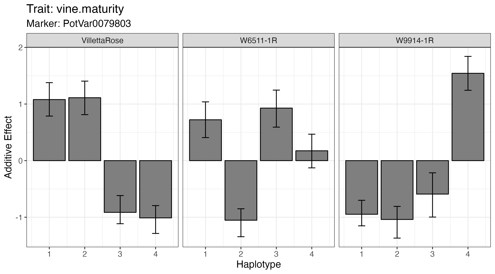

```{r set-options, echo=FALSE, cache=FALSE}
options(width = 100)

```

# Introduction

This tutorial uses a dataset generated at the University of Wisconsin-Madison [Potato Breeding Program](https://potatobreeding.cals.wisc.edu/). The results are published on [The genetic architectures of vine and skin maturity in tetraploid potato](https://link.springer.com/article/10.1007/s00122-022-04159-z).

To download the files please go to: 

<https://github.com/mcaraza-harter/MCH_ToolsForPolyploidsExample.git>

Tutorial link:

<>

# Genotyping

Breeding lines were genotyped with version 3 of the potato SNP array (Felcher et al. 2012; Vos et al. 2015), and genotype calls were made using R package [fitPoly](https://cran.r-project.org/web/packages/fitPoly/index.html) (Voorrips et al. 2011; Zych et al. 2019). Each marker data point is the estimated dosage (0–4) of the B allele for the sample. Version 4.03 of the DM reference genome was used for physical positions (Potato Genome Sequencing Consortium 2011; Sharma et al. 2013).

# Genotypes calls

[polyBreedR](https://github.com/jendelman/polyBreedR) is an R package designed to facilitate the use of genome-wide markers for breeding autotetraploid (4x) species. It covers the making of tetraploid genotype calls from SNP array intensities, and their utility for pedigree curation ([Vignette](https://jendelman.github.io/polyBreedR/polyBreedR_Vignette1.html)). The function `geno_call` makes genotypes calls from the allele ratio data matrix. 

# Haplotype reconstruction

[PolyOrigin](https://github.com/chaozhi/PolyOrigin.jl) (Zheng et al. 2021)

A package for haplotype reconstruction in connected tetraploid F1 populations. Runs in [Julia](https://julialang.org/downloads/). There are vignettes available for different data types. This example uses potato data from a 3x3 diallel population.

From Julia:

```julia
using PolyOrigin
cd("/Users/mariacaraza/Downloads/MCH_QTLmapping/data/PolyOrigin_example/")
genofile="RedDiallele_geno.csv"
pedfile="RedDiallele_ped.csv"
```


Check input files:

```julia
using CSV, DataFrames, Plots
show(CSV.read(pedfile,DataFrame)[1:8,:],eltypes=false)
show(CSV.read(genofile,DataFrame)[1:5,1:7],eltypes=false)
```


Plot cross design for the 3x3 diallel cross:

```julia
polygeno = readPolyGeno(genofile, pedfile,isphysmap=true)
PolyOrigin.plotdesign(polygeno)
```


Run PolyOrigin (takes ~8 min with subset data):

```julia
@time polyancestry = polyOrigin(genofile, pedfile;
                                isphysmap=true,
                                recomrate=1.25,
                                refinemap=true,
                                refineorder=false,
                                chrsubset=1:1,
                                snpsubset=1:5:1000,
                                isparallel=true,
                                outstem="Subset_PotatoDiallel")
```


The returned polyancestry from polyOrigin has been saved:

`outfiles = filter(x->occursin("Subset_PotatoDiallel",x), readdir())` 

```
7-element Vector{String}:
 "Subset_PotatoDiallel.log"
 "Subset_PotatoDiallel_genoprob.csv"
 "Subset_PotatoDiallel_maprefined.csv"
 "Subset_PotatoDiallel_parentphased.csv"
 "Subset_PotatoDiallel_parentphased_corrected.csv"
 "Subset_PotatoDiallel_polyancestry.csv"
 "Subset_PotatoDiallel_postdoseprob.csv"
```


Visualize haplotype probabilities of a single offspring

```julia
plotCondprob(polyancestry,offspring=6)
savefig("Subset_PotatoDiallel_Offspring6.png")
```


# QTL mapping using diaQTL

[diaQTL](https://github.com/jendelman/diaQTL) ([Amadeu et al, 2021](https://academic.oup.com/genetics/article/219/3/iyab124/6339585?login=false)) is an R package designed for QTL and haplotype analysis of autotetraploid (and diploid) diallel populations. Phenotypes are regressed on genotype probabilities, and the regression coefficients are random effects ([Vignette](https://jendelman.github.io/diaQTL/diaQTL_Vignette.html)). The PolyOrigin software is recommended to calculate the genotype probabilities for tetraploids. 


## Import the data

Input files needed for QTL analysis: pedigree file, genotype file, and phenotype file. Several functions are available to prepare input files from PolyOrigin, MAPpoly, RABBIT, and onemap. 

To install:

```r
install.packages("devtools")
devtools::install_github("jendelman/diaQTL", build_vignettes=FALSE)
```

### Load and convert data

Load the package and convert data from PolyOrigin:

```{r}
library(diaQTL)
library(ggplot2)

setwd("../data/PolyOrigin_example/FullOutput/")
ans1 <- convert_polyorigin(filename="Potato_diallel_output_polyancestry.csv", mapfile="RedDiallele_mapfile.csv")
```

The files generated are stored in the same working directory. Look for files named:
```
diaQTL_genofile.csv
diaQTL_parents.csv
diaQTL_pedfile.csv
```


**1. Pedigree file**

```{r}
pedcsv <- "../data/diaQTL_example/diaQTL_pedfile.csv"
ped <- read.csv(pedcsv, as.is = T, check.names = F )
head(ped)
```


**2. Genotype file**

```{r}
genocsv <- "../data/diaQTL_example/diaQTL_genofile.csv"
geno <- read.csv(genocsv, as.is = T, check.names = F )
geno[1:5,1:4]
```


**3. Phenotype file**

```{r}
phenocsv <- "../data/diaQTL_example/VMdiallel.csv"
pheno <- read.csv( phenocsv, as.is = T, check.names = F)
head(pheno)
```


### Read the data

Read data using `read_data`, this function reads the three files (it takes ~5 min).

```{r}
diallel_vine <- read_data(genofile = genocsv,
                          ploidy = 4,
                          pedfile = pedcsv,
                          phenofile = phenocsv,
                          dominance = 4, 
                          n.core = 3)
```


## QTL discovery

The `scan1` function performs a linear regression for each position in the map (it takes ~3 min).

```{r}
scan1.vine <- scan1( data = diallel_vine,
                     trait = "vine.maturity", 
                     params = list(burnIn=50,nIter=600),
                     chrom = NULL,
                     dominance = 1,
                     n.core = 3)
```


### Detection threshold

Get the map size using `get_map` function, and the DIC threshold using `DIC_thresh`.

```{r}
get_map(diallel_vine) 
alpha.05 <- DIC_thresh(genome.size=13.12,num.parents=3,
                       ploidy=4,alpha=0.05) 
alpha.1 <- DIC_thresh(genome.size=13.12,num.parents=3,
                      ploidy=4,alpha=0.1) 
cat(alpha.1,alpha.05)
```

```
Total map size: 13.12
alpha.05 = 17.74
alpha.1  = 20.04
```

```{r}
ans1 <- scan1_summary(scan1.vine)

ans1$plot + geom_hline(yintercept = 17.74,linetype=2,colour="red")
```


```{r}
ans1$peaks
```


### QTL modeling

Fitting a multiple QTL model with `fitQTL`.
```{r}
qtl.4 <- ans1$peaks$marker[4]
qtl.5 <- ans1$peaks$marker[5]

fit.vine <- fitQTL(data=diallel_vine,trait="vine.maturity",
               params=list(burnIn=100,nIter=3000),
               qtl=data.frame(marker=c(qtl.4,qtl.5),dominance=c(1,1)))
```


Plotting the additive haplotype effect

`fit.vine$plots$PotVar0079803$additive`




Proportion of variance for the effects
```{r}
fit.vine$var
```


### Haplotype-based Selection

Once the desirable haplotype is selected, using the function `haplo_get` we can extract the dosage of this haplotype across the population. 

```{r}
haplos <- haplo_get( data = diallel_vine, marker = qtl.5)

which(haplos[,"W6511-1R.2"] > 1.8) #which individuals have 2 copies of "W6511-1R.2"
```


We use the function `haplo_plot` to visualize the pattern of recombination between parental haplotypes.
```{r}
haplo_plot( data = diallel_vine, 
            id = "W15268-65R", 
            chrom = 5,
            position = "cM",
            marker = qtl.5)
```


# Genome-wide association 

**Using [GWASpoly](https://github.com/jendelman/GWASpoly)**

A [Vignette](https://jendelman.github.io/GWASpoly/GWASpoly.html) is available to illustrate the basic workflow using a different potato dataset that comes with the package.

To install:

```
install.packages("devtools")
devtools::install_github("jendelman/GWASpoly", build_vignettes=FALSE)
```

## Load and read data

```{r}
library(GWASpoly)
data <- read.GWASpoly(ploidy=4,
                      pheno.file="../data/GWASpoly_example/VMgwas.csv",
                      geno.file="../data/GWASpoly_example/marker_data.csv",
                      n.traits=1,format="numeric")
```


## QTL discovery

```{r}
data <- set.K(data,LOCO=TRUE,n.core=2)
params <- set.params(fixed="env",fixed.type="factor",geno.freq=1-5/586)
data <- GWASpoly(data,models=c("additive"),traits="vine.maturity",params=params,n.core=2)
data <- set.threshold(data,n.core=2,level=0.1)
manhattan.plot(data,models="additive") + guides(shape="none") + theme(strip.text = element_blank())
```


## QTL effects and R2

```{r}
qtl <- get.QTL(data,models="additive",bp.window=5e6)
qtl
```

```{r}
fit.QTL(data=data,trait="vine.maturity",
        qtl=data.frame(Marker=qtl[c(1,4),"Marker"],Model="additive"),
        fixed=data.frame(Effect="env",Type="factor"))
```

The QTL on chr05 explains 33% of the variation vs. 4% for the QTL on chr06.


